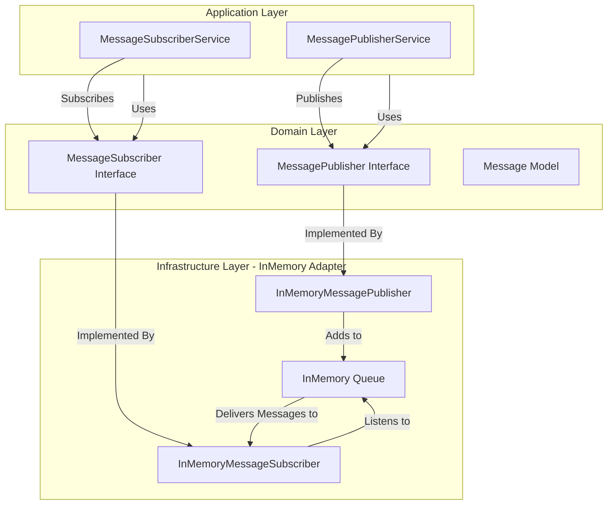

# PubSub-Hexagonal

```mermaid
flowchart TB

    %% Domain layer - Ports
    subgraph DomainLayer [Domain Layer]
        MessagePublisher[MessagePublisher Interface]
        MessageSubscriber[MessageSubscriber Interface]
        Message[Message Model]
    end

    %% Application Layer - Services
    subgraph ApplicationLayer [Application Layer]
        MessagePublisherService[MessagePublisherService]
        MessageSubscriberService[MessageSubscriberService]
    end

    %% Infrastructure Layer - In-Memory Queue Adapter
    subgraph InMemoryAdapter [Infrastructure Layer - InMemory Adapter]
        InMemoryMessagePublisher[InMemoryMessagePublisher]
        InMemoryMessageSubscriber[InMemoryMessageSubscriber]
        Queue[InMemory Queue]
    end

    %% Relationships
    ApplicationLayer -->|Uses| MessagePublisher
    ApplicationLayer -->|Uses| MessageSubscriber

    MessagePublisherService -->|Publishes| MessagePublisher
    MessageSubscriberService -->|Subscribes| MessageSubscriber

    MessagePublisher -->|Implemented By| InMemoryMessagePublisher
    MessageSubscriber -->|Implemented By| InMemoryMessageSubscriber

    InMemoryMessagePublisher -->|Adds to| Queue
    InMemoryMessageSubscriber -->|Listens to| Queue
    Queue -->|Delivers Messages to| InMemoryMessageSubscriber

```